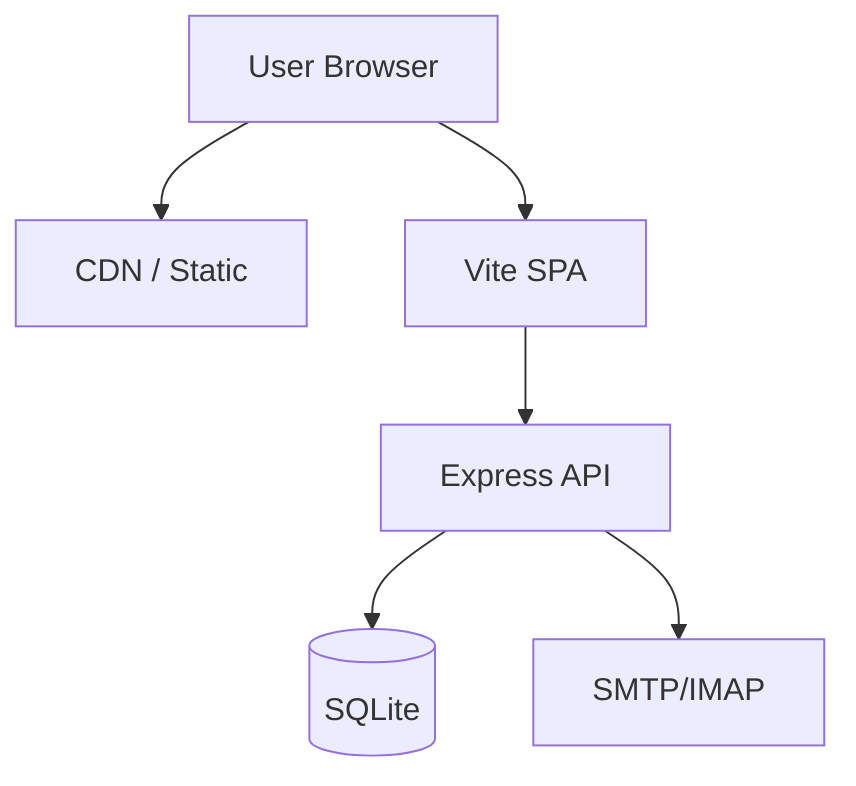
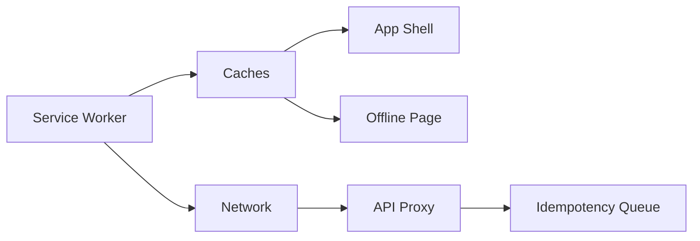
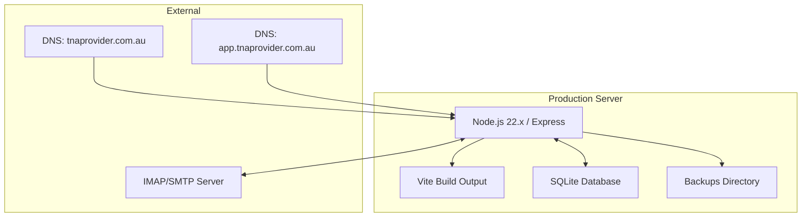

# TNA Provider — System Architecture

## Overview

TNA Provider is a full-stack web application and PWA for managing commercial fitout, shopfitting, and joinery businesses. It serves two distinct surfaces: a public marketing website and a private application platform.



---

## Public Website (tnaprovider.com.au)

The public site is a pre-rendered SPA deployed at `tnaprovider.com.au` / `www.tnaprovider.com.au`.

- **Marketing pages**: Home, About, Services, Sectors, Projects, Materials, FAQ, Contact, Privacy Policy, Terms of Service.
- **Interactive tools**: Cost Estimator, Timeline Predictor, Tender Upload, Project Map.
- **Pre-rendered HTML** is generated at build time by `scripts/prerender.mjs` via the `postbuild` script. Each page produces a static `.html` file served by the Express catch-all (`app.js:188`). This ensures SEO without a separate SSR framework.
- **Static assets** (icons, images, fonts) are served with `max-age=1h`, ETag, and Last-Modified headers.
- Hosted on a single Node/Express server that serves both the public site and the API.

---

## Application Platform (app.tnaprovider.com.au)

The private application is a React SPA mounted at `/app` and accessible at `app.tnaprovider.com.au`.

- **Legacy `/platform` paths are redirected** to `app.tnaprovider.com.au` via middleware (`app.js:37`).
- **Dashboard** — per-role landing page with KPIs, recent activity, and quick actions.
- **Quotes** — full quote builder with sections, items, templates, revisions, PDF generation, public share tokens, and review workflow.
- **Timesheets** — real-time shift tracking with check-in/check-out, break control, live money meter, GPS geofencing, and QR code site verification.
- **Payroll** — pay rule configuration, payroll export batches, and integrated pay breakdown (ordinary time, overtime, double time).
- **Leads & CRM** — lead tracking, scoring, activities, follow-ups, and automation.
- **Projects** — project management with tasks, client access control, variations, and document storage.
- **Client Portal** — client-facing view of projects, updates, comments, and documents.
- **Admin Tools** — backup management, CSV exports, storage monitoring, health checks.
- **Email Integration** — inbox management, compose/send, folder operations, and attachment handling.
- **Notifications** — in-app notifications with channels for email mock, lead/task/project alerts.
- **Reports** — operational reporting with audit log access.

---

## Role Model

The system uses a hierarchical role-based access control (RBAC) model defined in the `users` table:

| Role | Scope | Key Permissions |
|------|-------|-----------------|
| **owner** | Full system ownership | All operations including user creation, role changes, backups, hourly-rate changes, admin tools, payroll exports |
| **admin** | Administrative | All operations except owner-only actions (user role changes, backups, owner profile management) |
| **manager** | Operational | Manage projects, timesheets, maintenance, quotes, tasks, client access. Denied: user management, pay rules, admin tools, employee rates |
| **worker** | Self-service | View own profile, submit timesheets, shift check-in/out, QR site check-in. Denied: all admin/management endpoints |
| **client** | Limited read | Client portal access (assigned projects, updates, documents). Denied: all platform API routes |

Enforcement is via middleware (`middleware/roles.js`) using `requireRole(...)` guards on each route. The `platform.js` routes also use `requirePasswordChanged` to force password changes before granting access.

---

## Offline PWA Architecture

The application provides offline capability through a service worker and manifest:



- **Service Worker** (`public/sw.js`): Installs with app shell (root, offline page, manifest, icons). Activates by claiming clients and evicting stale caches.
- **Cache strategy**: Network-first for API requests, cache-first for static build assets. API requests are proxied through the service worker, falling back to cached responses when offline.
- **Offline page** (`public/offline.html`): Shown when the app shell is cached but the network is unavailable.
- **QR check-in/out** supports offline operation via an `offline_action_receipts` table. Workers scan QR codes while offline; actions are queued with idempotency keys and processed once connectivity resumes.
- **Manifest** (`public/manifest.webmanifest`): Declares the app as installable with `display: standalone`, theme colour `#0f172a`, and SVG icons at 192px and 512px.

---

## Email Integration

```mermaid
graph LR
    A[Express API] --> B[Mail Connector]
    B --> C[IMAP (inbound)]
    B --> D[SMTP (outbound)]
    B --> E[Mock Provider]
    C --> F[info@tnaprovider.com.au]
    D --> F
```

- **Provider abstraction**: `server/email/mailConnector.js` delegates to SMTP (`smtpConnector.js`), IMAP (`imapConnector.js`), or a mock provider (`mockMailConnector.js`) based on the `MAIL_PROVIDER` environment variable.
- **Inbound**: IMAP polling reads the `info@tnaprovider.com.au` mailbox. Supports listing messages, reading by ID, marking as read, moving between folders, and deleting.
- **Outbound**: SMTP via Nodemailer for sending quotes, invoices, and notifications. PDF attachments are generated server-side using PDFKit.
- **Mock mode**: In test environments, `MAIL_PROVIDER=mock` avoids real network calls while preserving API contracts.
- **Email API routes** are mounted at `/api/email/*` in `app.js:78-175` and require authentication with `owner` or `admin` role.
- **Email client UI** in the platform includes compose, inbox list, message preview, attachment list, folder sidebar, and settings.

---

## Deployment Topology



- **Single-server deployment**: Both the public site and the API run on the same Node.js process (`server.js`). The Express app serves the Vite-built SPA from `dist/` as static files.
- **SQLite**: Embedded database via `better-sqlite3`. File stored at `data/tna.db` by default (configurable via `DATABASE_URL`). Migrations run automatically at startup via `server/startup.js:12-19`.
- **Backups**: Admin-triggered via `VACUUM INTO` (hot backup without downtime). Stored in `data/backups/`. Accessible only to `owner` role.
- **Environment**: Configured via `.env` file (or env vars). Key settings: `DATABASE_URL`, `SESSION_SECRET`, `MAIL_PROVIDER`, `MAIL_DEFAULT_MAILBOX`, `HOST`, `PORT`, `GEMINI_API_KEY`.
- **Build pipeline**: Vite produces the production bundle. The `postbuild` hook runs `prerender.mjs` to generate static HTML for SEO-critical pages.
- **Deployment script**: `install.sh` handles OS dependencies (libwebkit2gtk for PDF generation, build-essential for native modules), Node.js version check, npm install, and database migration.
- **DNS split**: `tnaprovider.com.au` → public marketing SPA; `app.tnaprovider.com.au` → application platform (or redirected from legacy `/platform` paths).

---

## Technology Stack

| Layer | Technology |
|-------|-----------|
| Frontend | React 19, TypeScript, Vite 6, Tailwind CSS 4, React Router 7 |
| Backend | Express 4, Node.js 22.x |
| Database | SQLite (better-sqlite3) |
| Email | Nodemailer (SMTP), ImapFlow (IMAP) |
| PDF | PDFKit |
| QR | qrcode.react |
| Auth | bcrypt, session tokens, cookie-based |
| PWA | Service Worker, Web Manifest |
| CI | GitHub Actions |

---

## Data Flow

1. **User requests** arrive at the Express server. The host header determines routing context.
2. **Public page requests** (`GET /`, `/about`, etc.) served via pre-rendered static HTML from `dist/` with SPA fallback.
3. **API requests** (`/api/*`) are processed by route handlers which query SQLite via prepared statements.
4. **Authentication** uses session tokens stored in HTTP-only cookies, validated by `middleware/auth.js`.
5. **Email** is sent/received via the mail connector abstraction, with mock fallback for development.
6. **Offline actions** (QR check-in) are stored with idempotency keys and processed when connectivity is restored.
7. **Backups** are created on-demand via SQLite `VACUUM INTO`, producing a consistent snapshot without server downtime.
